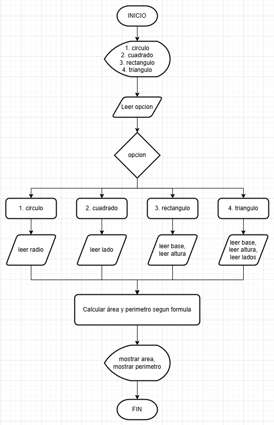
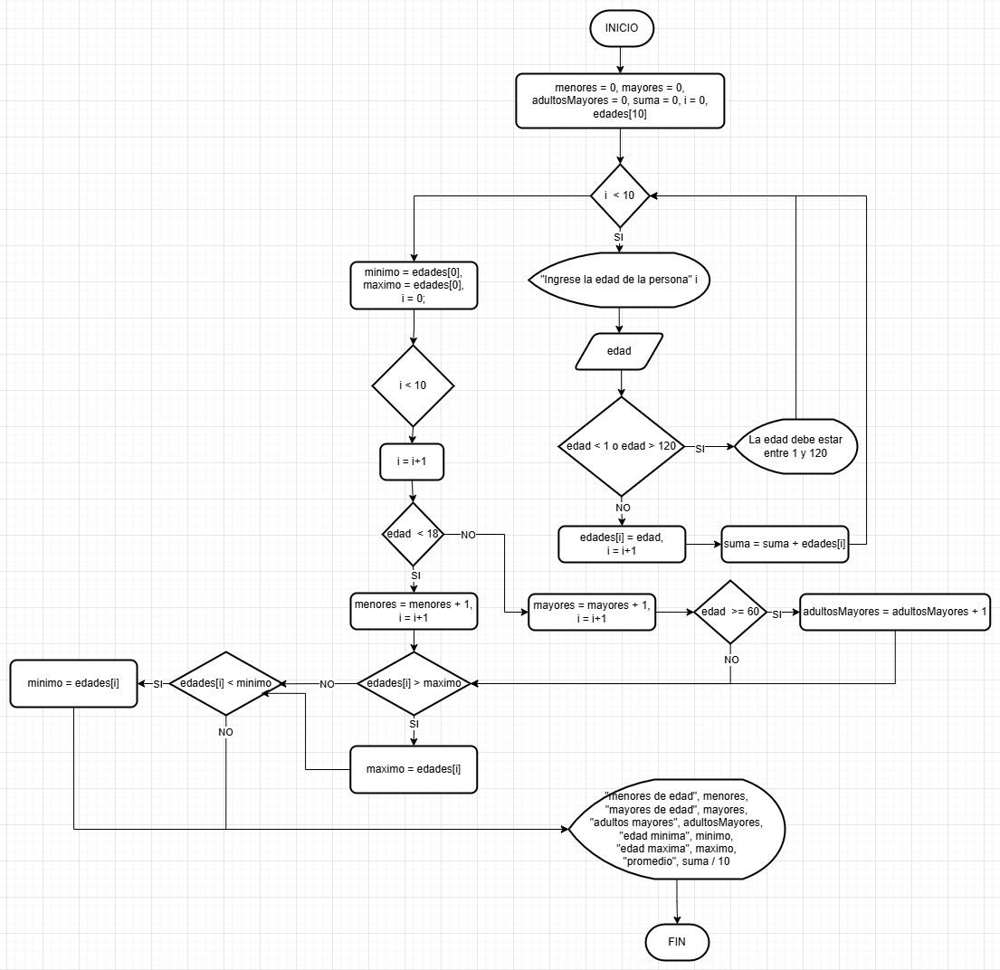
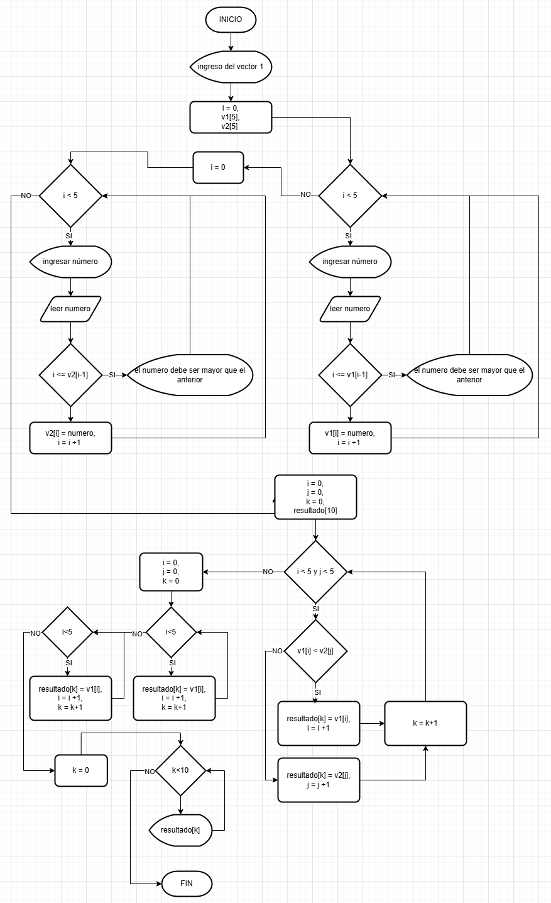
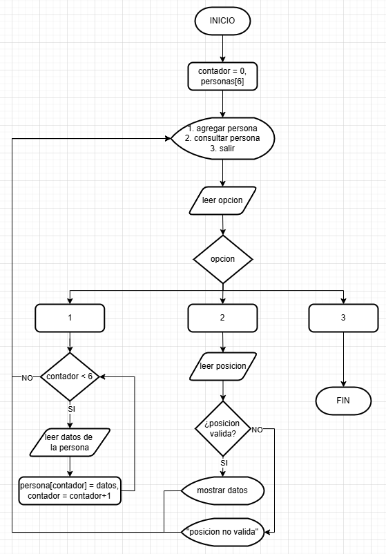

# Resolución a problemas algorítmicos aplicando estructuras de almacenamiento.

En esta actividad deberá aplicar todos los conocimientos adquiridos a lo largo del componente formativo, para dar solución a problemas, utilizando todas las estructuras de control requeridas y el lenguaje JavaScript.

Utilizando el lenguaje JavaScript, desarrollar un programa que dé solución a los siguientes problemas:

1. Desarrollar un programa que permita calcular el área o perímetro de algunas figuras planas, según la siguiente tabla:

**Tabla 1**

Área y perímetro de figuras planas


2. Desarrollar un programa que permita almacenar las edades de un grupo de 10 personas en un vector de enteros y luego determine la cantidad de personas que son menores de edad, mayores de edad, cuántos adultos mayores, la edad más baja, la edad más alta y el promedio de edades ingresadas. Para el ejercicio anterior, suponga que un adulto mayor debe tener una edad igual o superior a 60. Debe validar para cada ingreso, que los valores estén en un rango entre 1 y 120 años. En caso de error deberá notificar y solicitar un nuevo valor.

3. Escriba un programa que lea dos vectores de números enteros ordenados ascendentemente y luego produzca la lista ordenada de la mezcla de los dos, por ejemplo, si los dos arreglos tienen los números 1 3 6 9 17 y 2 4 10 17, respectivamente, la lista de números en la pantalla debe ser 1 2 3 4 6 9 10 17 17. Limite los vectores a un tamaño de 5 y debe validar en cada ingreso que realmente se estén ingresando los datos de forma ascendente.

4. Una emisora con presencia en diferentes ciudades, desea conocer el rating de canciones y cantantes más escuchados (sonados) en este semestre del año. Por lo tanto, se ha pedido a aprendices del SENA desarrollar una solución que permita conocer la respuesta de 6 personas con relación a sus gustos musicales. Con fines administrativos y realizar una rifa entre las personas encuestadas, la emisora desea poder registrar de las personas entrevistadas su nombre, número de identificación (cédula), fecha de nacimiento, correo electrónico, ciudad de residencia, ciudad de origen. Además, se deberá poder almacenar el artista y título de hasta 3 canciones favoritas en cada una de las personas que se ingrese. Teniendo en cuenta lo anterior, se sugiere que la solución deberá mostrar un menú que permita las siguientes opciones:

    **a.** Agregar una persona con los datos que se listan anteriormente.

    **b.** Mostrar la información personal de una persona particular por                    medio de su posición en el vector.


## Soluciones

1. 
### Pseudocódigo:

```pseudocode
ALGORITMO FigurasGeometricas;

VAR
 CADENA figura;

 REAL radio;
 REAL lado;
 REAL base;
 REAL altura;
 REAL ladoA;
 REAL ladoB;

 REAL area;
 REAL perimetro;

INICIO

 ESCRIBIR ("Seleccione una figura:");
 ESCRIBIR ("1. Círculo");
 ESCRIBIR ("2. Cuadrado");
 ESCRIBIR ("3. Rectángulo");
 ESCRIBIR ("4. Triángulo");

 LEER (figura);

 SEGUN figura HACER

   CASO "1":
      ESCRIBIR ("Ingrese el radio:");
      LEER (radio);

      area <- PI * radio * radio;
      perimetro <- 2 * PI * radio;

   CASO "2":
      ESCRIBIR ("Ingrese el lado:");
      LEER (lado);

      area <- lado * lado;
      perimetro <- 4 * lado;

   CASO "3":
      ESCRIBIR ("Ingrese la base:");
      LEER (base);

      ESCRIBIR ("Ingrese la altura:");
      LEER (altura);

      area <- base * altura;
      perimetro <- 2 * (base + altura);

   CASO "4":
      ESCRIBIR ("Ingrese la base:");
      LEER (base);

      ESCRIBIR ("Ingrese la altura:");
      LEER (altura);

      ESCRIBIR ("Ingrese lado A:");
      LEER (ladoA);

      ESCRIBIR ("Ingrese lado B:");
      LEER (ladoB);

      area <- (base * altura) / 2;
      perimetro <- base + ladoA + ladoB;

 FIN SEGUN

 ESCRIBIR ("El área es:");
 ESCRIBIR (area);

 ESCRIBIR ("El perímetro es:");
 ESCRIBIR (perimetro);

FIN
```

### Diagrama de flujo


2. 
### Pseudocódigo:
    
  ```pseudocode
ALGORITMO calcularDiezEdades;
VAR
    Definir edades, i Como Entero
    Definir menores, mayores, adultosMayores Como Entero
    Definir minima, maxima, suma Como Entero
    Definir promedio Como Real
    Dimension edades[10]    

INICIO
    menores <- 0
    mayores <- 0
    adultosMayores <- 0
    suma <- 0
    
    Para i <- 1 Hasta 10 Con Paso 1 Hacer
        Escribir "Ingrese la edad de la persona ", i, ":"
        Leer edades[i]
        
        suma <- suma + edades[i]
        
        Si edadIngresada < 1 O edadIngresada > 120 Entonces
            Escribir "Error: La edad debe estar en el rango de 1 a 120 años."
        FinSi

        Si edades[i] < 18 Entonces
            menores <- menores + 1
        Sino
            mayores <- mayores + 1
        FinSi
        
        Si edades[i] >= 60 Entonces
            adultosMayores <- adultosMayores + 1
        FinSi
    FinPara
    
    minima <- edades[1]
    maxima <- edades[1]
    
    Para i <- 2 Hasta 10 Con Paso 1 Hacer
        Si edades[i] < minima Entonces
            minima <- edades[i]
        FinSi
        Si edades[i] > maxima Entonces
            maxima <- edades[i]
        FinSi
    FinPara
    
    promedio <- suma / 10

    Escribir "Menores de edad: ", menores
    Escribir "Mayores de edad: ", mayores
    Escribir "Adultos mayores: ", adultosMayores
    Escribir "Edad mínima: ", minima
    Escribir "Edad máxima: ", maxima
    Escribir "Promedio de edades: ", promedio
FinAlgoritmo
```
### Diagrama de flujo


3. 
### Pseudocódigo:
```pseudocode
ALGORITMO MezclarVectoresOrdenados;

VAR
 ENTERO v1[5];
 ENTERO v2[5];
 ENTERO resultado[10];

 ENTERO i;
 ENTERO j;
 ENTERO k;
 ENTERO num;

INICIO

 ESCRIBIR ("Ingreso del vector 1");

 PARA i <- 0 HASTA 4 HACER

    REPETIR
       ESCRIBIR ("Ingrese un número en orden ascendente:");
       LEER (num);

       SI (i > 0) Y (num <= v1[i-1]) ENTONCES
          ESCRIBIR ("Error: debe ser mayor que el anterior");
       FIN SI

    HASTA QUE (i = 0) O (num > v1[i-1]);

    v1[i] <- num;

 FIN PARA

 ESCRIBIR ("Ingreso del vector 2");

 PARA i <- 0 HASTA 4 HACER

    REPETIR
       ESCRIBIR ("Ingrese un número en orden ascendente:");
       LEER (num);

       SI (i > 0) Y (num <= v2[i-1]) ENTONCES
          ESCRIBIR ("Error: debe ser mayor que el anterior");
       FIN SI

    HASTA QUE (i = 0) O (num > v2[i-1]);

    v2[i] <- num;

 FIN PARA

 i <- 0;
 j <- 0;
 k <- 0;

 MIENTRAS (i < 5) Y (j < 5) HACER

    SI (v1[i] < v2[j]) ENTONCES
       resultado[k] <- v1[i];
       i <- i + 1;
    SINO
       resultado[k] <- v2[j];
       j <- j + 1;
    FIN SI

    k <- k + 1;

 FIN MIENTRAS

 MIENTRAS (i < 5) HACER
    resultado[k] <- v1[i];
    i <- i + 1;
    k <- k + 1;
 FIN MIENTRAS

 MIENTRAS (j < 5) HACER
    resultado[k] <- v2[j];
    j <- j + 1;
    k <- k + 1;
 FIN MIENTRAS

 ESCRIBIR ("Vector mezclado ordenado:");

 PARA k <- 0 HASTA 9 HACER
    ESCRIBIR (resultado[k]);
 FIN PARA

FIN
```

### Diagrama de flujo



4. 
### Pseudocódigo:
```pseudocode
ALGORITMO RegistroPersonas;

VAR

 ENTERO opcion;
 ENTERO contador;

 ESTRUCTURA Persona
   CADENA nombre;
   CADENA cedula;
   CADENA fechaNacimiento;
   CADENA correo;
   CADENA ciudadResidencia;
   CADENA ciudadOrigen;
   CADENA artista;
   CADENA cancion1;
   CADENA cancion2;
   CADENA cancion3;
 FIN ESTRUCTURA

 Persona personas[6];

 ENTERO posicion;

INICIO

 contador <- 0;

 REPETIR

   ESCRIBIR ("MENU");
   ESCRIBIR ("1. Agregar persona");
   ESCRIBIR ("2. Consultar persona");
   ESCRIBIR ("3. Salir");

   LEER (opcion);

   SEGUN opcion HACER

     CASO 1:

        SI (contador < 6) ENTONCES

           ESCRIBIR ("Ingrese nombre:");
           LEER (personas[contador].nombre);

           ESCRIBIR ("Ingrese cédula:");
           LEER (personas[contador].cedula);

           ESCRIBIR ("Ingrese fecha de nacimiento:");
           LEER (personas[contador].fechaNacimiento);

           ESCRIBIR ("Ingrese correo:");
           LEER (personas[contador].correo);

           ESCRIBIR ("Ingrese ciudad de residencia:");
           LEER (personas[contador].ciudadResidencia);

           ESCRIBIR ("Ingrese ciudad de origen:");
           LEER (personas[contador].ciudadOrigen);

           ESCRIBIR ("Ingrese artista favorito:");
           LEER (personas[contador].artista);

           ESCRIBIR ("Ingrese canción 1:");
           LEER (personas[contador].cancion1);

           ESCRIBIR ("Ingrese canción 2:");
           LEER (personas[contador].cancion2);

           ESCRIBIR ("Ingrese canción 3:");
           LEER (personas[contador].cancion3);

           contador <- contador + 1;

        SINO
           ESCRIBIR ("No se pueden registrar más personas");
        FIN SI

     CASO 2:

        ESCRIBIR ("Ingrese la posición a consultar (0 a ", contador-1, "):");
        LEER (posicion);

        SI (posicion >= 0) Y (posicion < contador) ENTONCES

           ESCRIBIR ("Nombre: ", personas[posicion].nombre);
           ESCRIBIR ("Cédula: ", personas[posicion].cedula);
           ESCRIBIR ("Fecha nacimiento: ", personas[posicion].fechaNacimiento);
           ESCRIBIR ("Correo: ", personas[posicion].correo);
           ESCRIBIR ("Ciudad residencia: ", personas[posicion].ciudadResidencia);
           ESCRIBIR ("Ciudad origen: ", personas[posicion].ciudadOrigen);
           ESCRIBIR ("Artista: ", personas[posicion].artista);
           ESCRIBIR ("Canciones: ",
                     personas[posicion].cancion1, ", ",
                     personas[posicion].cancion2, ", ",
                     personas[posicion].cancion3);

        SINO
           ESCRIBIR ("Error: posición inválida");
        FIN SI

     CASO 3:
        ESCRIBIR ("Fin del programa");

   FIN SEGUN

 HASTA QUE (opcion = 3);

FIN
```

 ### Diagrama de flujo

 